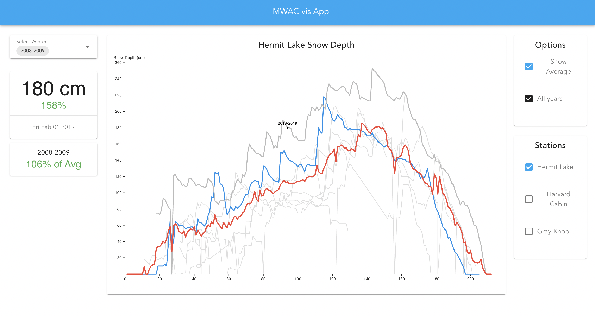

# MWAC Visualization Tool

A Vue.js-based visualization tool for displaying snow depth data from the Mount Washington Avalanche Center (MWAC).



## Features

- Interactive snow depth visualization
- Historical data comparison
- Multiple winter season selection
- Real-time data updates
- Station selection (Hermit Lake, Harvard Cabin, Gray Knob)
- Historical averages display
- Interactive hover data points

## Project Setup

```bash
# Install dependencies
npm install

# Start development server
npm run serve

# Build for production
npm run build

# Lint and fix files
npm run lint
```

## Technology Stack

- Vue 3
- TypeScript
- D3.js for data visualization
- Vuetify for UI components
- Vuex for state management

## Data Sources

The visualization uses snow depth data from various stations including:
- Hermit Lake
- Harvard Cabin
- Gray Knob

## Configuration

See [Vue CLI Configuration Reference](https://cli.vuejs.org/config/).

## Development

This project uses:
- TypeScript for type safety
- ESLint and Prettier for code formatting
- SASS for styling
- Vue Router for navigation

## License

[Add your license information here]

# snowpack-vis
